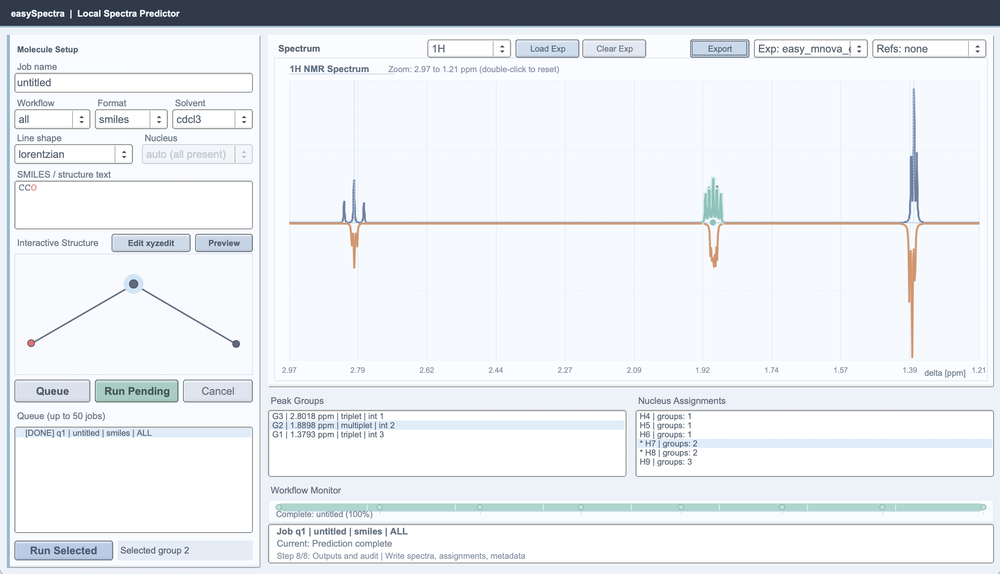

# easySpectra



`easySpectra` is a local app for predicting and comparing spectra without needing cloud services.

It is built for ease of use:
- paste a structure,
- run predictions,
- load experimental data,
- compare visually,
- export a clean figure.

Current version: `0.0.1`

## What You Can Do Today

- Predict NMR spectra (`1H`, `13C`, `19F`, `31P`)
- Run a CD prediction path (`cd` workflow scaffold)
- Run everything at once (`all` workflow, default)
- Overlay experimental traces against computed traces
- Switch between multiple loaded experimental overlays in the GUI
- Export the plotted spectrum view (`.png` or `.ppm`)

## 5-Minute Setup

### 1) Install Python dependencies

```bash
pip install -r backend/requirements.txt
```

### 2) Build the project

macOS / Linux:

```bash
cmake -S . -B build
cmake --build build -j
```

Windows (PowerShell):

```powershell
cmake -S . -B build
cmake --build build --config Release
```

### 3) Launch the GUI

macOS / Linux:

```bash
./build/easynmr-gui
```

Windows (PowerShell):

```powershell
.\build\Release\easynmr-gui.exe
```

If you use a single-config generator (for example Ninja), use:

```powershell
.\build\easynmr-gui.exe
```

Note on command names:
- The product name is `easySpectra`.
- Current binary names are still `easynmr`, `easynmr-gui`, and `easynmr-expcheck` for compatibility.
- If FLTK is not found, CMake builds CLI-only. Install FLTK, or use `-DEASYSPECTRA_BUILD_GUI=OFF`.

## Quick GUI Workflow

1. Paste SMILES or structure text.
2. Leave `Workflow` as `all` (default), or choose `nmr`/`cd`.
3. Click `Preview`.
4. Click `Queue`, then `Run Pending`.
5. Use `Load Exp` to load an experimental file.
6. Switch overlays with the `Exp:` selector (`none` or a loaded file).
7. Click `Export` to save exactly what you see in the spectrum panel.
8. Export as `.png` or `.ppm` on macOS, Linux, or Windows.

## Quick CLI Workflow

Basic run:

```bash
./build/easynmr --input "CCO" --input-format smiles --name ethanol
```

Explicit workflow selection:

```bash
./build/easynmr --workflow all --input "CCO" --input-format smiles
./build/easynmr --workflow nmr --input "CCO" --input-format smiles
./build/easynmr --workflow cd  --input "CCO" --input-format smiles
```

Helpful options:
- `--workflow <all|nmr|cd>`
- `--nucleus <auto|1H|13C|19F|31P>`
- `--solvent <cdcl3|dmso|h2o>`
- `--frequency-mhz <number>`
- `--line-shape <lorentzian|gaussian|voigt>`
- `--fwhm-hz <number>`

Outputs are written to `output/<job-id>/`.

## Comparing Computed vs Experimental

Supported experimental inputs:
- Bruker-like exported text
- MNova-like exported text
- Generic 2-column text/CSV (`x, y`)

Current limits:
- Bruker raw acquisition folders are not parsed directly yet.
- MNova project files (`.mnova`, `.mnv`) are not parsed directly yet.
- Export vendor data to 2-column text/CSV first, then load it.

In the GUI, experimental overlays are drawn on the same x-axis with negative y-values for direct comparison against computed traces.

If an import ever fails and you want a quick parser check:

```bash
./build/easynmr-expcheck <experimental-spectrum-file>
```

## Benchmarks, Examples, and Coverage

The bundled computed/experimental files are included to document broad testing coverage across workflows (`nmr`, `cd`) and nuclei (`1H`, `13C`, `19F`, `31P`) with easy/medium/hard cases.

Main mapping files (including SMILES and computed/experimental pairings):
- `examples/benchmark_cases.csv`
- `tests/spectra_comparison_cases.csv`

Bundled data locations:
- `examples/computed/`
- `examples/experimental/`
- `examples/external_nmr_pack/`
- `examples/figures/`

### Project check scripts

- `./scripts/smoke_products_and_experimental.sh` builds the project and runs a quick end-to-end smoke check across key workflows and overlay parsing.
- `./tests/run_spectra_comparison_matrix.sh` runs the full easy/medium/hard case matrix from the mapping table.
- `./scripts/generate_example_pack.py` regenerates the bundled computed and overlay example set from the current workflow behavior.

## Where Important Output Files Live

Each run typically includes:
- `spectra_manifest.csv`
- `audit.json`
- `structure.svg`
- `structure_atoms.csv`
- `structure_bonds.csv`
- spectrum-specific files such as `spectrum_1h.csv`, `peaks_1h.csv`, `assignments_1h.csv` (and equivalent for `13C`, `19F`, `31P`, `cd`)

## Optional Backend Controls

- `EASYSPECTRA_XTB=/path/to/xtb` sets xTB path
- `EASYSPECTRA_XTB_TIMEOUT=25` sets per-conformer timeout (seconds)
- `EASYSPECTRA_XTB=__none__` forces MMFF fallback mode

## Extra Project Docs

- `docs/ARCHITECTURE.md`
- `docs/ROADMAP.md`
- `docs/TODO.md`
- `docs/SPEC.md`
- `docs/EXPERIMENTAL_NMR_CONVERSION_AND_TESTING_CHECKLIST.md`
- `docs/CHANGELOG.md`

## Tested NMR References

- Easy (`20-1H`, Bruker + Mnova + JCAMP): DOI [10.14469/hpc/11523](https://doi.org/10.14469/hpc/11523)
- Medium (`20-13C`, Bruker + Mnova + JCAMP): DOI [10.14469/hpc/11524](https://doi.org/10.14469/hpc/11524)
- Hard (`20-hsqc`, Bruker + Mnova + JCAMP): DOI [10.14469/hpc/13944](https://doi.org/10.14469/hpc/13944)
